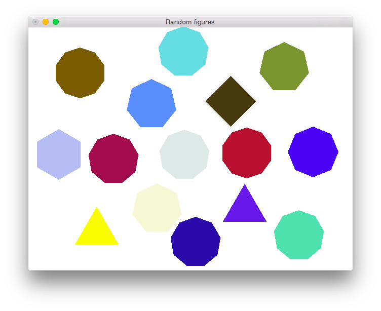

# random-figures

[](https://travis-ci.org/cmc-haskell-2015/random-figures)

Генерация случайных фигур.



## Установка и запуск

Для установки клонируйте репозиторий и запустите `cabal install`:

```
$ git clone https://github.com/cmc-haskell-2015/random-figures.git
$ cd random-figures
$ cabal install
```

Для запуска используйте

```
$ cabal run
```

